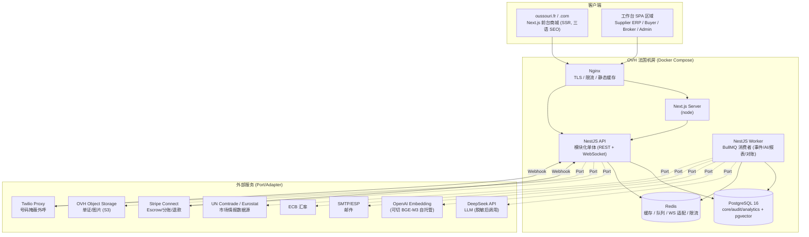

# OUSSOURI AI — Step 3 系统架构设计

> 版本：V1.0　日期：2026-07-03
> 前置文档：step-02-requirements-specification.md（已确认）
> 状态：待确认 → 确认后进入 Step 4（数据库设计）

---

## 1. 架构决策总览（Architecture Decisions）

| # | 决策 | 理由 |
|---|---|---|
| A1 | **模块化单体（Modular Monolith）**，而非微服务 | 团队规模与 Phase 1 交付速度优先；NestJS Module 边界 = 限界上下文 = 未来微服务拆分线。模块间只允许通过"应用服务接口 + 领域事件"通信，禁止跨模块直查对方表 |
| A2 | **Monorepo**（pnpm workspaces + Turborepo） | 前后端共享类型（DTO/枚举/校验 schema），一次提交全链路类型安全 |
| A3 | **事件驱动 + Outbox 模式** | 撮合、通知、审计、翻译都是订单/行为的副作用；Outbox 表保证"业务写库与事件发布"原子性，Redis(BullMQ) 消费，未来可平滑换 Kafka |
| A4 | **CQRS-lite** | 写模型走 DDD 聚合与状态机；读模型（市场目录、看板）走专用查询服务 + 物化视图，不引入独立读库 |
| A5 | **单 PostgreSQL 多 Schema** | `core`（业务）、`audit`（只追加）、`analytics`（物化视图/事件流）、`vector`（pgvector）逻辑隔离，运维单实例，成本可控 |
| A6 | 所有对外能力走 **Port/Adapter（六边形）抽象** | Payment(Stripe)、LLM(DeepSeek)、Embedding(OpenAI/BGE-M3)、Telephony(Twilio)、Mail(SMTP/ESP)、Storage(OVH S3)、FX(ECB) 均定义 Port 接口 + 默认 Adapter，可替换（D2–D4 决策落地） |
| A7 | **BFF 不单独建服务** | Next.js Server Components / Route Handlers 直接调 API 的公开层；API 按角色域划分守卫，不再加一层网关服务 |

---

## 2. 系统架构图

### 2.1 总体拓扑（C4 - Container 级）



### 2.2 内部分层（每个业务模块统一结构，Clean Architecture）

```
┌─────────────────────────────────────────────────────┐
│ Presentation   Controller / Gateway(WS) / DTO / Guard│  ← 鉴权、校验、可见性裁剪
├─────────────────────────────────────────────────────┤
│ Application    UseCase Service / Command / Query     │  ← 事务边界、状态机调用、事件发布
├─────────────────────────────────────────────────────┤
│ Domain         Entity / ValueObject / DomainEvent /  │  ← 纯业务规则，零框架依赖
│                StateMachine 定义 / Policy            │
├─────────────────────────────────────────────────────┤
│ Infrastructure Repository(Prisma) / 外部 Adapter     │  ← 实现 Domain 定义的 Port
└─────────────────────────────────────────────────────┘
```

依赖方向严格向内；Domain 不依赖 Prisma/Nest。模块对外只导出 Application 层接口与领域事件类型。

---

## 3. 限界上下文与模块映射（Bounded Contexts）

| 限界上下文 | 包含的需求模块（M） | NestJS 模块 | Phase |
|---|---|---|---|
| **Identity & Access** 身份权限 | 用户/RBAC/2FA/穿透审批（M18 部分、M19） | `iam` | P1 |
| **Party** 交易主体 | 供应商/采购商主档、资质、入驻审核（M02/M03 主档部分） | `party` | P1 |
| **Catalog** 商品目录 | 品类/品种/等级字典、产品、翻译、上架审核（M04、M15 管道） | `catalog` | P1 |
| **Traceability** 溯源 | 产源单元/原料批次/养护/加工批次（M02 溯源域） | `traceability` | P2 |
| **Inventory** 库存 | 批次库存、流水账、预留 TTL（M05） | `inventory` | P1 |
| **Trading** 交易 | 订单状态机、购物车、RFQ、拍卖、期货（M06/M07/M08） | `trading` | P1 核心 / P2 RFQ / P3 拍卖期货 |
| **Settlement** 资金 | Escrow、账本、佣金、退款、发票（M09） | `settlement` | P1 |
| **Fulfillment** 履约 | 物流多段、冷链、清关、单证引擎（M10/M11/M12） | `fulfillment` | P2 |
| **Brokerage** 居间撮合 | 行为事件、画像、四维评分、商机、代下单、外呼、脱敏发送（M13/M14） | `brokerage` | P2 |
| **Communication** 通讯 | IM + 拦截、通知中心（M16/M17） | `communication` | P1 |
| **Intelligence** 情报分析 | Analytics、Market Intelligence、AI 报告（M20/M21） | `intelligence` | P3 |
| **AI Platform** AI 底座 | LLM/Embedding Port、RAG、Copilot、PII 过滤器（M22、GBR-1.4） | `ai-platform` | P1 底座 / P3 完全体 |
| **Platform Kernel** 平台内核 | 编码引擎、可见性策略、状态机引擎、审计、i18n、配置中心（GBR 全部、M18/M19） | `kernel` | P1 |

**关键规则**：`kernel` 与 `ai-platform` 是横向底座，任何模块可依赖；业务上下文之间**互不直接依赖**，通过领域事件（如 `OrderPaid`）或 kernel 提供的查询接口协作。

## 4. 核心机制设计

### 4.1 身份防火墙的技术实现（GBR-1 落地）

三道防线，层层兜底：

1. **存储层**：PII 字段（电话/邮箱/税号/银行）列级加密（AES-256-GCM，密钥走环境 KMS/密钥文件，密文入库）；真实名称与代码的映射只存于 `party` 上下文。
2. **序列化层（主防线）**：全局响应拦截器执行 **字段级可见性策略**——DTO 字段标注敏感级别，拦截器按"当前角色 × 字段策略 × 业务上下文（如订单状态）"裁剪或脱敏（如 `Michelin***`），策略数据化存于 kernel，deny-by-default。
3. **出口层**：PII 过滤器（正则 + NER）扫描所有出站通道——API 响应抽样、IM 消息、通知渲染结果、AI 输出、导出文件。命中即阻断 + 审计。

### 4.2 事件流（Outbox → BullMQ）

```
UseCase 事务：业务写库 + outbox 表插入事件（同一事务）
   └→ Worker 轮询/监听 outbox → 发布到 BullMQ 主题队列 → 标记已发布
        ├→ audit 消费者：写审计流水
        ├→ notification 消费者：模板渲染 → 邮件/站内信
        ├→ matchmaking 消费者：更新画像/触发评分
        ├→ translation 消费者：缺语种内容生成机翻草稿
        └→ analytics 消费者：事实表落库
```

关键领域事件（首批）：`PartyRegistered/Approved`、`ProductPublished`、`InventoryReserved/Released`、`OrderPlaced/Paid/Confirmed/Shipped/Delivered/Completed/Disputed`、`EscrowReleased`、`CertificateExpiring`、`BehaviorTracked`、`OpportunityDetected`、`MessageBlocked`、`AccessEscalated`。

### 4.3 状态机引擎（GBR-6 落地）

kernel 提供通用状态机执行器：迁移定义（源/目标/允许角色/守卫表达式/副作用事件）存 DB 并缓存；业务模块注册各自的机（订单、拍卖、报关、争议、商机、期货）。执行器统一负责：权限校验 → 守卫求值 → 乐观锁更新 → 审计 → 发事件。

### 4.4 AI 底座（ai-platform）

- **LLMPort**：`complete(task, messages, opts)`，按任务路由模型（翻译/文案/推理可配不同 provider+model），默认 DeepSeek；重试/超时/成本记账（token 计量入库）。
- **出站脱敏**：调用 LLM 前强制通过 `PiiScrubber`（把已知实体名/联系方式替换为代码占位符），返回后可逆还原占位符 —— PII 永不出境（GDPR 约束落地）。
- **EmbeddingPort**：默认 OpenAI `text-embedding-3-small`；产品/需求/知识文档统一 1536 维入 pgvector（HNSW 索引）。
- **RAG**：知识文档分块 → 向量化 → 检索 → 注入 prompt；Copilot 工具调用严格以"当前用户身份"执行现有 UseCase（权限天然继承，AI 不越权）。

### 4.5 实时通道

WebSocket（Socket.IO + Redis adapter）：拍卖竞价房间、IM 会话、Broker 商机红点推送。鉴权复用 JWT，房间订阅做资源级权限校验。

---

## 5. Monorepo 文件夹结构

```
oussouri/
├── apps/
│   ├── web/                          # Next.js 15 (App Router)
│   │   ├── app/
│   │   │   ├── [locale]/             # zh / en / fr 路由前缀
│   │   │   │   ├── (marketplace)/    # 公开商城：目录/详情/搜索
│   │   │   │   ├── (buyer)/          # 采购商工作台
│   │   │   │   ├── (supplier)/       # 供应商 ERP
│   │   │   │   ├── (broker)/         # 居间作业台
│   │   │   │   └── (admin)/          # 管理后台
│   │   │   └── api/                  # Route Handlers（仅 BFF 轻聚合）
│   │   ├── components/               # 业务组件（按域分目录）
│   │   ├── lib/                      # api client / auth / i18n 工具
│   │   └── messages/                 # UI 文案 zh.json en.json fr.json
│   └── api/                          # NestJS
│       ├── src/
│       │   ├── kernel/               # 编码引擎/可见性/状态机/审计/i18n/配置
│       │   ├── ai-platform/          # LLM/Embedding Port + PII Scrubber + RAG
│       │   ├── modules/
│       │   │   ├── iam/              # 每模块内: presentation/ application/ domain/ infrastructure/
│       │   │   ├── party/
│       │   │   ├── catalog/
│       │   │   ├── traceability/
│       │   │   ├── inventory/
│       │   │   ├── trading/
│       │   │   ├── settlement/
│       │   │   ├── fulfillment/
│       │   │   ├── brokerage/
│       │   │   ├── communication/
│       │   │   └── intelligence/
│       │   ├── workers/              # BullMQ 消费者（按事件主题）
│       │   └── main.ts / app.module.ts
│       └── prisma/
│           ├── schema.prisma
│           ├── migrations/
│           └── seed/                 # 字典种子：品种/国家/币种/单证模板
├── packages/
│   ├── shared/                       # 前后端共享：DTO 类型、枚举、zod schema、常量
│   ├── ui/                           # shadcn 封装的设计系统组件
│   └── config/                       # eslint / tsconfig / tailwind preset
├── infra/
│   ├── docker-compose.yml            # 生产：nginx/web/api/worker/postgres/redis
│   ├── docker-compose.dev.yml
│   ├── nginx/
│   └── backup/                       # pg_dump 定时脚本 → OVH S3
├── docs/                             # 本系列设计文档
└── turbo.json / pnpm-workspace.yaml
```

---

## 6. 安全架构

| 层 | 措施 |
|---|---|
| 边界 | Nginx TLS1.3、全局与登录接口双层限流（Redis 滑动窗口）、WAF 基础规则 |
| 认证 | JWT（15min）+ Refresh Token 旋转（httpOnly cookie）；OAuth2（Google/微信预留）；内部角色强制 TOTP 2FA |
| 授权 | RBAC（角色-权限矩阵）+ 数据范围（own/party/all）+ 字段级可见性策略三级 |
| 输入 | zod/class-validator 全端点校验；Prisma 参数化（防 SQLi）；输出转义 + CSP（防 XSS）；SameSite+CSRF token |
| 数据 | PII 列级加密；备份加密；密钥与代码分离；日志脱敏（不落 PII） |
| 供应链 | 锁定依赖版本、Dependabot、镜像扫描 |
| GDPR | 数据驻留 OVH FR；LLM 出站前脱敏；被遗忘权工作流（匿名化替代物理删除以保交易凭证完整）；Cookie 同意 |

---

## 7. 部署拓扑（OVH, Phase 1）

单节点起步、纵向扩展，预留水平扩展缝：

```
OVH 服务器 (推荐 16C/64G/NVMe 起步)
└── Docker Compose
    ├── nginx          (80/443, certbot 自动续期)
    ├── web            (Next.js, 可多副本)
    ├── api            (NestJS, 可多副本 — 无状态)
    ├── worker         (BullMQ 消费者, 按队列可拆副本)
    ├── postgres:16    (pgvector 扩展; 数据卷 + 每日 dump → OVH S3 异地)
    └── redis:7        (AOF 持久化)
```

- CI/CD：GitHub Actions → 构建镜像 → 推私有 Registry → SSH 部署（compose pull & up），健康检查通过才切流。
- 扩展路径：流量增长后 web/api/worker 分主机 → PG 主从读分离 → 队列换 Kafka → 按限界上下文拆微服务（模块边界已备好）。

---

## 8. 风险与缓解（架构视角）

| 风险 | 缓解 |
|---|---|
| 单体膨胀、模块边界腐化 | ESLint 边界规则（`import` 白名单）强制模块只依赖 kernel 与事件；CI 校验 |
| Outbox 消费重复/乱序 | 消费者幂等（事件 ID 去重表）；同聚合事件按 key 串行 |
| Stripe Webhook 丢失 | 签名校验 + 事件持久化 + 定时对账补偿任务 |
| pgvector 数据量增长 | HNSW 索引 + 分区；必要时外迁专用向量库（Port 已抽象） |
| 单节点故障 | 每日备份 + 4h RTO 恢复脚本演练；Phase 2 起加从库与多节点 |

## 9. 未来扩展点

- 行业模板机制：品类字典 + 溯源字段组 + 单证清单模板 三件套即可上线新行业（松露/和牛/葡萄酒），零核心代码改动。
- 多租户白标（为大型分销商开子站）：Party 上下文已按 organization 建模，预留 `tenant_id` 扩展位。
- 移动端：API 层与 BFF 分离清晰，可直接接 React Native。

---

*本文档为 Step 3 产出。确认后进入 Step 4：数据库设计（完整 Prisma Schema 级 ER 设计，含全部表、索引、约束）。*
