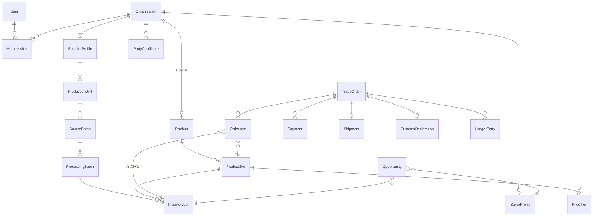

# OUSSOURI AI — Step 4 数据库设计

> 版本：V1.0　日期：2026-07-03
> 前置文档：step-03-architecture-design.md（已确认）
> 状态：待确认 → 确认后进入 Step 5（API 设计）
> 说明：本文为 Schema 级设计。为可读性，每个模型省略书写"标准列"（见 §1.1），Step 7 生成 `schema.prisma` 时全量展开。模型名 PascalCase，表名 snake_case 复数（`@@map`），此处仅示意关键 `@@map/@@index`。

---

## 1. 全局约定

### 1.1 标准列（所有业务表统一，简写 `[std]`）

```prisma
id        String   @id @default(uuid()) @db.Uuid
createdAt DateTime @default(now())
updatedAt DateTime @updatedAt
createdBy String?  @db.Uuid
updatedBy String?  @db.Uuid
deletedAt DateTime?            // 软删除；所有查询默认过滤
version   Int      @default(0) // 乐观锁
```

### 1.2 其他约定

- **Schema 划分**：`core`（业务）、`audit`（只追加）、`analytics`（事件流/物化视图）、`vector`（pgvector）。
- **金额**：`Decimal @db.Decimal(14,2)`；**重量**：kg，`Decimal @db.Decimal(12,3)`；**汇率**：`Decimal @db.Decimal(12,6)`。
- **加密列**：命名 `xxxEnc`，`Bytes` 类型（AES-256-GCM 密文），应用层加解密；同时存盲索引列 `xxxBidx`（HMAC）用于等值查询。
- **枚举**：数据库原生 enum（Prisma enum）；可运营配置的字典（品类/等级/单证类型）用表而非 enum。
- **多语**：`EntityTranslation` 统一翻译表，业务表只存源语言内容与 `sourceLocale`。
- **软删除唯一性**：唯一索引均为部分索引 `WHERE deleted_at IS NULL`（Prisma 层用 `@@unique` + migration 手工改部分索引）。

### 1.3 核心 ER 总览



---

## 2. Kernel（平台内核，schema: core + audit）

```prisma
/// 编码规则（GBR-2）
model CodeRule {            // [std]
  entityType   String  @unique      // SUPPLIER/BUYER/PRODUCT/ORDER/...
  prefix       String               // SP / BY / ORD
  pattern      String               // 如 "{prefix}-{seq:6}" / "{prefix}-{date:YYYYMMDD}-{seq:5}"
  seqLength    Int     @default(6)
  jumpMax      Int     @default(7)  // 随机跳步上限（防遍历）
  currentSeq   BigInt  @default(0)  // 行锁递增
}

/// 字段级可见性策略（GBR-1）
model VisibilityPolicy {    // [std]
  resource     String               // 如 "party.supplier"
  field        String               // 如 "companyName"
  role         String               // 角色 code；* 为默认
  contextRule  Json?                // 业务上下文条件，如 {"orderStatus": ["CONFIRMED+"]}
  effect       VisibilityEffect     // ALLOW / MASK / DENY
  maskPattern  String?              // 如 "keep:2,4"
  @@unique([resource, field, role])
}
enum VisibilityEffect { ALLOW MASK DENY }

/// 状态机定义（GBR-6）
model StateMachine {        // [std]
  code        String @unique        // ORDER / AUCTION / CUSTOMS / DISPUTE / OPPORTUNITY / FUTURES
  states      Json                  // 状态清单与元数据
}
model StateTransition {     // [std]
  machineCode String
  fromState   String
  toState     String
  allowedRoles String[]
  guard       Json?                 // 守卫表达式（规则 DSL）
  emitsEvent  String?               // 领域事件名
  @@unique([machineCode, fromState, toState])
}

/// 统一翻译表（GBR-3）
model EntityTranslation {   // [std]
  entityType  String                // Product / Grade / NotificationTemplate ...
  entityId    String  @db.Uuid
  field       String                // name / description
  locale      String                // zh-CN / en / fr
  value       String  @db.Text
  status      TranslationStatus @default(MACHINE_DRAFT)
  @@unique([entityType, entityId, field, locale])
  @@index([entityType, entityId])
}
enum TranslationStatus { MACHINE_DRAFT REVIEWED }

/// 汇率快照（GBR-4）
model ExchangeRate {        // [std]
  base   String  // EUR
  quote  String  // USD/CNY/GBP/JPY
  rate   Decimal @db.Decimal(12,6)
  source String  // ECB
  asOf   DateTime
  @@unique([base, quote, asOf])
}

model Country {             // [std]
  iso2         String @unique       // FR/CN
  currencyCode String              // 默认币种
  vatRate      Decimal? @db.Decimal(5,2)
  euMember     Boolean @default(false)
  // name 三语走 EntityTranslation
}

model ConfigEntry {         // [std]
  namespace String
  key       String
  value     Json
  @@unique([namespace, key])
}

/// Outbox（架构 A3）
model OutboxEvent {
  id          String   @id @default(uuid()) @db.Uuid
  aggregate   String                // 聚合类型+ID，用于分区键
  eventType   String                // OrderPaid ...
  payload     Json
  createdAt   DateTime @default(now())
  publishedAt DateTime?
  @@index([publishedAt, createdAt])
}

/// 审计（schema: audit，只追加，无 update/delete 权限）
model AuditLog {
  id         String   @id @default(uuid()) @db.Uuid
  actorId    String?  @db.Uuid
  actorRole  String?
  action     String                 // LOGIN/CREATE/UPDATE/STATE_CHANGE/VIEW_SENSITIVE/EXPORT/BLOCKED_MESSAGE...
  targetType String?
  targetId   String?  @db.Uuid
  diff       Json?                  // 前后值（敏感字段仅记字段名）
  reason     String?                // 穿透事由
  ip         String?
  userAgent  String?
  occurredAt DateTime @default(now())
  @@index([actorId, occurredAt])
  @@index([targetType, targetId, occurredAt])
}

/// 穿透审批（M19 FR-19-02）
model AccessEscalation {    // [std]
  requesterId  String  @db.Uuid
  targetType   String               // party.supplier
  targetId     String  @db.Uuid
  fields       String[]
  reason       String
  sensitivity  Sensitivity          // LOW 即时放行 / HIGH 需审批
  status       EscalationStatus @default(PENDING) // PENDING/APPROVED/DENIED/EXPIRED
  approvedBy   String? @db.Uuid
  windowUntil  DateTime?            // 可见窗口截止
}
enum Sensitivity { LOW HIGH }
enum EscalationStatus { PENDING APPROVED DENIED EXPIRED }
```

---

## 3. IAM（身份与访问）

```prisma
model User {                // [std]
  emailEnc    Bytes                 // 加密
  emailBidx   String  @unique       // 盲索引（登录查找）
  phoneEnc    Bytes?
  phoneBidx   String?
  passwordHash String?              // argon2id
  displayName String                // 昵称（非真实姓名要求）
  locale      String  @default("en")
  totpSecretEnc Bytes?              // 内部角色强制
  status      UserStatus @default(ACTIVE) // ACTIVE/LOCKED/DISABLED
  lastLoginAt DateTime?
}
model OAuthAccount {        // [std]
  userId   String @db.Uuid
  provider String                   // google / wechat
  providerUid String
  @@unique([provider, providerUid])
}
model Role {                // [std]
  code String @unique               // GUEST/BUYER/SUPPLIER/BROKER/CS/QC/LOGISTICS/CUSTOMS/FINANCE/ADMIN/SUPER_ADMIN
  isInternal Boolean @default(false) // 内部角色强制 2FA
}
model Permission {          // [std]
  code String @unique               // trading.order.read / party.pii.escalate ...
}
model RolePermission {      // [std]
  roleId String @db.Uuid
  permissionId String @db.Uuid
  dataScope DataScope @default(OWN) // OWN / PARTY / ALL
  @@unique([roleId, permissionId])
}
model UserRole {            // [std]
  userId String @db.Uuid
  roleId String @db.Uuid
  @@unique([userId, roleId])
}
model Session {             // [std]
  userId      String @db.Uuid
  refreshHash String @unique        // 旋转刷新令牌
  ip          String?
  expiresAt   DateTime
  revokedAt   DateTime?
}
enum DataScope { OWN PARTY ALL }
enum UserStatus { ACTIVE LOCKED DISABLED }
```

---

## 4. Party（交易主体）— 真实身份唯一存放地

```prisma
model Organization {        // [std]
  publicCode   String  @unique      // SP-000018 / BY-000256（编码引擎签发）
  partyType    PartyType            // SUPPLIER / BUYER / BOTH
  // ↓ 全部敏感，仅 party 模块可解密，出口走可见性策略
  legalNameEnc      Bytes           // 公司全称（源语言）
  legalNameBidx     String          // 查重
  registrationNoEnc Bytes?          // 统一社会信用代码 / SIREN
  taxIdEnc          Bytes?          // VAT 号
  legalRepEnc       Bytes?
  addressEnc        Bytes?          // 注册地址
  countryIso2  String               // 国家（粒度到国家可公开用于筛选）
  status       PartyStatus @default(PENDING) // PENDING/ACTIVE/SUSPENDED/INACTIVE
  approvedBy   String? @db.Uuid
  approvedAt   DateTime?
  riskNotes    String? @db.Text
}
enum PartyType { SUPPLIER BUYER BOTH }
enum PartyStatus { PENDING ACTIVE SUSPENDED INACTIVE }

model Membership {          // [std]  用户 ↔ 组织
  userId String @db.Uuid
  orgId  String @db.Uuid
  orgRole String                    // OWNER / MEMBER
  @@unique([userId, orgId])
}

model Contact {             // [std]  联系人（全加密）
  orgId     String @db.Uuid
  nameEnc   Bytes
  positionEnc Bytes?
  phoneEnc  Bytes?
  emailEnc  Bytes?
  imEnc     Bytes?                  // 微信/WhatsApp
  isPrimary Boolean @default(false)
}

model SupplierProfile {     // [std]
  orgId          String @unique @db.Uuid
  establishedAt  DateTime?
  registeredCapital Decimal? @db.Decimal(14,2)
  businessScope  String? @db.Text
  tier           String?            // 平台内部供应商分级
  exportReady    Boolean @default(false) // 出口资质齐备（由证书状态推导缓存）
}

model BuyerProfile {        // [std]
  orgId        String @unique @db.Uuid
  buyerType    BuyerType            // WHOLESALER/RETAILER/RESTAURANT/IMPORTER/DISTRIBUTOR
  city         String?
  creditScore  Decimal @default(60) @db.Decimal(5,1) // 0-100，规则引擎更新
  totalPurchases Decimal @default(0) @db.Decimal(14,2) // EUR 口径缓存
  churnRiskAt  DateTime?            // 流失预警时间（M13 信号）
}
enum BuyerType { WHOLESALER RETAILER RESTAURANT IMPORTER DISTRIBUTOR }

model Address {             // [std]  收货/发货地址簿
  orgId      String @db.Uuid
  label      String
  recipientEnc Bytes
  phoneEnc   Bytes
  line1Enc   Bytes
  cityEnc    Bytes
  postcode   String?
  countryIso2 String
  isDefault  Boolean @default(false)
}

model PartyCertificate {    // [std]  主体资质（M12 统一单证的主体子集）
  orgId       String @db.Uuid
  certType    String               // 字典：BUSINESS_LICENSE/SC/CITES_QUALIFICATION/EXPORT_LICENSE/ISO/...
  certNo      String
  issuer      String?
  issueDate   DateTime?
  expiryDate  DateTime?
  fileKey     String?              // OVH S3 对象 key（私有桶）
  status      CertStatus @default(PENDING) // PENDING/VALID/EXPIRED/REJECTED
  @@index([orgId, certType])
  @@index([expiryDate])            // 到期扫描任务
}
enum CertStatus { PENDING VALID EXPIRED REJECTED }
```

---

## 5. Catalog（商品目录）

```prisma
model Category {            // [std]  品类树（行业模板锚点）
  code      String @unique          // CAVIAR / FISH_MEAT / TRUFFLE ...
  parentId  String? @db.Uuid
  industryTemplate String?          // STURGEON / TRUFFLE ...（决定溯源字段组与单证清单）
  sortOrder Int @default(0)
}

model Species {             // [std]  品种字典
  code       String @unique         // DAU / SCH / DAUHUS（规范化，无×）
  latinName  String
  citesAppendix String?             // I / II / III
  fatherCode String?                // 杂交父本
  motherCode String?                // 杂交母本
  maturityYears String?
  avgEggSizeMm Decimal? @db.Decimal(4,2)
  // 中/英/法名走 EntityTranslation
}

model Grade {               // [std]  等级字典（平台自定义）
  code       String @unique         // G001
  categoryCode String
  criteria   Json?                  // {eggSizeMm:">=3.5", color:[...], ageYears:">=15"}
  // 名称三语走 EntityTranslation（赫哲传承级/Héritage Hezhe）
}

model Product {             // [std]
  publicCode  String @unique        // PRD-000123
  supplierOrgId String @db.Uuid
  categoryCode String
  speciesCode String?
  gradeCode   String?
  hsCode      String
  originCountry String              // 公开到国家级；详细产地脱敏
  originDetailEnc Bytes?            // 详细产地（含基地名，敏感）
  sourceLocale String @default("zh-CN")
  name        String                // 源语言名（译文走翻译表）
  description String? @db.Text
  status      ProductStatus @default(DRAFT) // DRAFT/PENDING_REVIEW/ACTIVE/INACTIVE/DISCONTINUED
  publishedAt DateTime?
  @@index([categoryCode, speciesCode, gradeCode, status])
}
enum ProductStatus { DRAFT PENDING_REVIEW ACTIVE INACTIVE DISCONTINUED }

model ProductSku {          // [std]  规格变体
  productId  String @db.Uuid
  skuCode    String @unique         // PRD-000123-050G
  packSpec   String                 // 50g/罐
  netWeightKg Decimal @db.Decimal(12,3) // 单件净重
  unit       String                 // TIN / KG / BOX
  moq        Decimal @default(1) @db.Decimal(10,2)
  shelfLifeDays Int?
  storageTempMin Decimal? @db.Decimal(4,1)
  storageTempMax Decimal? @db.Decimal(4,1)
  status     SkuStatus @default(ACTIVE)
}
enum SkuStatus { ACTIVE INACTIVE }

model PriceTier {           // [std]  阶梯价（历史版本化）
  skuId       String @db.Uuid
  currency    String               // EUR ...
  qtyMin      Decimal @db.Decimal(10,2)
  qtyMax      Decimal? @db.Decimal(10,2)
  unitPrice   Decimal @db.Decimal(14,2)
  effectiveFrom DateTime
  effectiveTo DateTime?
  isActive    Boolean @default(true)
  @@index([skuId, currency, isActive])
}

model ProductMedia {        // [std]
  productId String @db.Uuid
  kind      MediaKind             // IMAGE / VIDEO / DOC
  fileKey   String                // 公开 CDN 桶
  sortOrder Int @default(0)
}
enum MediaKind { IMAGE VIDEO DOC }
```

---

## 6. Traceability（溯源，行业无关抽象）

```prisma
model ProductionUnit {      // [std]  产源单元（养殖场/庄园/牧场）
  supplierOrgId String @db.Uuid
  unitType   String                // FARM / VINEYARD / RANCH（字典）
  nameEnc    Bytes                 // 基地名敏感（可推断供应商）
  locationEnc Bytes
  countryIso2 String
  attributes Json                  // 行业模板字段组：{waterSource, waterTempMin, farmType, customsRegNo...}
  status     ActiveStatus @default(ACTIVE)
}
model ProductionSubunit {   // [std]  池塘/车间/地块
  unitId    String @db.Uuid
  name      String
  attributes Json                  // {areaM2, waterDepth, capacityKg, currentStockKg}
}
enum ActiveStatus { ACTIVE INACTIVE }

model SourceBatch {         // [std]  原料批次（鱼群批次）
  subunitId   String @db.Uuid
  batchNo     String               // 供应商自编
  speciesCode String?
  quantity    Int?                 // 尾数
  avgWeightKg Decimal? @db.Decimal(8,2)
  ageMonths   Int?
  originType  String?              // 人工繁育/野生驯养
  rfidStart   String?
  rfidEnd     String?
  status      SourceBatchStatus @default(GROWING) // GROWING/HARVESTED/SOLD/CLOSED
  @@unique([subunitId, batchNo])
}
enum SourceBatchStatus { GROWING HARVESTED SOLD CLOSED }

model IndividualAsset {     // [std]  个体资产（RFID 个体鱼，可选粒度）
  sourceBatchId String @db.Uuid
  rfid        String @unique
  gender      String?
  birthDate   DateTime?
  weightKg    Decimal? @db.Decimal(8,2)
  lengthCm    Decimal? @db.Decimal(6,2)
  healthStatus String @default("HEALTHY") // HEALTHY/WARNING/SICK/DEAD
  status      String @default("ALIVE")    // ALIVE/HARVESTED/DEAD
}

model CareRecord {          // [std]  养护记录（投喂/健康/用药统一）
  sourceBatchId String @db.Uuid
  recordType  CareType             // FEEDING / HEALTH / MEDICATION / MORTALITY
  recordDate  DateTime
  payload     Json                 // {feedType, amountKg} / {symptom, diagnosis, medication}
  withdrawalUntil DateTime?        // 休药期截止（MEDICATION 必填，加工守卫用）
  operator    String?
  @@index([sourceBatchId, recordType, recordDate])
}
enum CareType { FEEDING HEALTH MEDICATION MORTALITY }

model ProcessingBatch {     // [std]  加工批次
  supplierOrgId String @db.Uuid
  sourceBatchId String? @db.Uuid   // 溯源链
  batchNo     String               // HZBSC20251114
  categoryCode String              // 产出品类
  speciesCode String?
  rawWeightKg Decimal @db.Decimal(12,3)
  outputWeightKg Decimal @db.Decimal(12,3)
  processedAt DateTime
  attributes  Json                 // {productionLine, workshopTemp, inspector}
  qcStatus    QcStatus @default(IN_PROGRESS) // IN_PROGRESS/COMPLETED/QC_PASS/QC_FAIL
  @@unique([supplierOrgId, batchNo])
}
enum QcStatus { IN_PROGRESS COMPLETED QC_PASS QC_FAIL }

model ProcessingStep {      // [std]
  processingBatchId String @db.Uuid
  stepCode   String                // 字典：SALTING/EGG_SORTING/DEHYDRATION/CANNING/AGING（模板可配）
  startAt    DateTime?
  endAt      DateTime?
  temperature Decimal? @db.Decimal(4,1)
  operator   String?
  notes      String? @db.Text
  sortOrder  Int
}
```

---

## 7. Inventory（库存）

```prisma
model InventoryLot {        // [std]  批次库存（SKU × 加工批次）
  skuId       String @db.Uuid
  processingBatchId String? @db.Uuid  // 溯源链完整才可售（守卫）
  lotNo       String
  producedAt  DateTime
  expiresAt   DateTime
  warehouse   String?
  storageTemp Decimal? @db.Decimal(4,1)
  qtyOnHand   Decimal @default(0) @db.Decimal(12,3)  // 冗余缓存 = 流水聚合
  qtyReserved Decimal @default(0) @db.Decimal(12,3)
  status      LotStatus @default(AVAILABLE) // AVAILABLE/ON_HOLD/EXPIRED/SOLD_OUT
  @@unique([skuId, lotNo])
  @@index([expiresAt, status])       // 临期扫描（Urgency 信号）
}
enum LotStatus { AVAILABLE ON_HOLD EXPIRED SOLD_OUT }

model InventoryTransaction { // 只追加
  id        String   @id @default(uuid()) @db.Uuid
  lotId     String   @db.Uuid
  txType    InvTxType             // INBOUND/RESERVE/RELEASE/OUTBOUND/ADJUST
  qty       Decimal  @db.Decimal(12,3)   // 有符号
  refType   String?               // ORDER / OPPORTUNITY / ADJUSTMENT
  refId     String?  @db.Uuid
  createdAt DateTime @default(now())
  createdBy String?  @db.Uuid
  @@index([lotId, createdAt])
}
enum InvTxType { INBOUND RESERVE RELEASE OUTBOUND ADJUST }

model Reservation {         // [std]  预留（含 TTL）
  lotId     String @db.Uuid
  qty       Decimal @db.Decimal(12,3)
  refType   String                // ORDER / BROKER_INTENT / AUCTION
  refId     String @db.Uuid
  expiresAt DateTime?             // 意向单 24h（BR-05-01）
  status    ReservationStatus @default(HELD) // HELD/CONSUMED/RELEASED/EXPIRED
  @@index([expiresAt, status])
}
enum ReservationStatus { HELD CONSUMED RELEASED EXPIRED }
```

超卖兜底（migration 手写约束）：`CHECK (qty_on_hand >= 0 AND qty_reserved >= 0 AND qty_reserved <= qty_on_hand)`；预留/扣减在事务内 `SELECT ... FOR UPDATE`。

---

## 8. Trading（交易）

```prisma
model Cart {  /* [std] */  buyerOrgId String @unique @db.Uuid }
model CartItem {            // [std]
  cartId String @db.Uuid
  skuId  String @db.Uuid
  qty    Decimal @db.Decimal(10,2)
  @@unique([cartId, skuId])
}

model TradeOrder {          // [std]  @@map("trade_orders")
  publicCode   String @unique       // ORD-20261120-00001
  orderType    OrderType            // DIRECT/AUCTION/RFQ/FUTURES/BROKER
  buyerOrgId   String @db.Uuid
  supplierOrgId String @db.Uuid
  brokerUserId String? @db.Uuid     // 居间单归属（业绩）
  currency     String
  fxRateToEur  Decimal @db.Decimal(12,6) // 下单时刻快照
  itemsTotal   Decimal @db.Decimal(14,2)
  commissionRate Decimal @db.Decimal(5,4) // 快照
  commissionAmount Decimal @db.Decimal(14,2)
  grandTotal   Decimal @db.Decimal(14,2)
  status       String               // 状态机管理（ORDER 机），不用 enum 便于配置扩展
  shippingAddressId String? @db.Uuid
  incoterms    String?              // CIF/FOB/DDP
  disputeUntil DateTime?            // 争议期截止（分账守卫）
  placedAt     DateTime?
  completedAt  DateTime?
  notes        String? @db.Text
  @@index([buyerOrgId, status])
  @@index([supplierOrgId, status])
}
enum OrderType { DIRECT AUCTION RFQ FUTURES BROKER }

model OrderItem {           // [std]
  orderId    String @db.Uuid
  skuId      String @db.Uuid
  lotId      String? @db.Uuid      // 发货批次（发货时锁定）
  qty        Decimal @db.Decimal(10,2)
  unitPrice  Decimal @db.Decimal(14,2) // 快照（阶梯价求值结果）
  lineTotal  Decimal @db.Decimal(14,2)
  // 产品名/规格快照，防后续改名影响单据
  snapshot   Json
}

model Rfq {                 // [std]
  publicCode  String @unique        // RFQ-20260703-0001
  buyerOrgId  String @db.Uuid
  categoryCode String
  speciesCode String?
  gradeCode   String?
  packSpec    String?
  qty         Decimal @db.Decimal(10,2)
  targetPrice Decimal? @db.Decimal(14,2)
  currency    String @default("EUR")
  destCountry String
  deadline    DateTime
  scope       RfqScope @default(BROKERED) // TARGETED/BROKERED（默认经居间分发）
  status      String               // 状态机：OPEN/QUOTING/ACCEPTED/EXPIRED/CANCELLED
}
enum RfqScope { TARGETED BROKERED }

model Quote {               // [std]
  rfqId       String @db.Uuid
  supplierOrgId String @db.Uuid
  round       Int @default(1)      // 多轮议价版本
  unitPrice   Decimal @db.Decimal(14,2)
  moq         Decimal? @db.Decimal(10,2)
  leadTimeDays Int?
  validUntil  DateTime
  status      String               // DRAFT/SUBMITTED/COUNTERED/ACCEPTED/REJECTED
  @@unique([rfqId, supplierOrgId, round])
}

model Auction {             // [std]
  publicCode  String @unique
  skuId       String @db.Uuid
  lotId       String @db.Uuid
  supplierOrgId String @db.Uuid
  auctionType AuctionType          // ENGLISH/DUTCH/SEALED
  qty         Decimal @db.Decimal(10,2)
  startPrice  Decimal @db.Decimal(14,2)
  reservePrice Decimal? @db.Decimal(14,2) // 不公开
  bidIncrement Decimal @db.Decimal(14,2)
  depositAmount Decimal @db.Decimal(14,2)
  startAt     DateTime
  endAt       DateTime
  antiSnipeMin Int @default(5)     // 反狙击延时
  status      String               // 状态机：SCHEDULED/ACTIVE/CLOSED/SETTLED/CANCELLED
}
enum AuctionType { ENGLISH DUTCH SEALED }

model AuctionParticipant {  // [std]  临时竞买号（BR-06-01）
  auctionId  String @db.Uuid
  buyerOrgId String @db.Uuid
  paddleNo   String               // B01（场内代号）
  depositPaymentId String? @db.Uuid
  @@unique([auctionId, buyerOrgId])
  @@unique([auctionId, paddleNo])
}
model AuctionBid {          // 只追加
  id        String @id @default(uuid()) @db.Uuid
  auctionId String @db.Uuid
  participantId String @db.Uuid
  amount    Decimal @db.Decimal(14,2)
  isProxy   Boolean @default(false) // 代理出价
  maxProxyAmount Decimal? @db.Decimal(14,2)
  createdAt DateTime @default(now())
  @@index([auctionId, amount])
}

model FuturesContract {     // [std]  P3
  publicCode  String @unique        // FUT-...
  supplierOrgId String @db.Uuid
  skuId       String @db.Uuid
  estimatedQty Decimal @db.Decimal(10,2)
  lockedPrice Decimal @db.Decimal(14,2)
  currency    String
  depositPct  Decimal @db.Decimal(5,2)  // 10-20，按信用浮动
  deliveryFrom DateTime
  deliveryTo  DateTime
  status      String               // 状态机
}
model FuturesSubscription { // [std]
  contractId String @db.Uuid
  buyerOrgId String @db.Uuid
  qty        Decimal @db.Decimal(10,2)
  depositPaymentId String? @db.Uuid
  confirmedQty Decimal? @db.Decimal(10,2) // T-30 确认
  status     String
}

model Dispute {             // [std]
  orderId    String @db.Uuid
  raisedByOrgId String @db.Uuid
  reasonCode String                // 字典：QUALITY/COLD_CHAIN/SHORTAGE/DELAY/OTHER
  description String @db.Text
  evidence   Json                  // 文件 keys + IM 会话引用
  status     String                // 状态机：OPEN/INVESTIGATING/RESOLVED_REFUND/RESOLVED_PARTIAL/RESOLVED_REJECT
  resolution Json?
  resolvedBy String? @db.Uuid
}
```

---

## 9. Settlement（资金，影子账本）

```prisma
model StripeAccount {       // [std]  供应商 Connected Account
  orgId      String @unique @db.Uuid
  stripeAccountId String @unique
  onboardingStatus String          // PENDING/COMPLETE/RESTRICTED
  defaultCurrency String?
}

model Payment {             // [std]  收款（Buyer → 平台 Stripe）
  orderId    String? @db.Uuid
  refType    String               // ORDER/AUCTION_DEPOSIT/FUTURES_DEPOSIT
  refId      String @db.Uuid
  method     PayMethod            // STRIPE_CARD/STRIPE_SEPA/WIRE_MANUAL
  stripePaymentIntentId String? @unique
  amount     Decimal @db.Decimal(14,2)
  currency   String
  status     PayStatus @default(PENDING) // PENDING/SUCCEEDED/FAILED/REFUNDED/PARTIAL_REFUND
  paidAt     DateTime?
  wireProofKey String?             // 线下水单（人工核销）
  reconciledBy String? @db.Uuid
}
enum PayMethod { STRIPE_CARD STRIPE_SEPA WIRE_MANUAL }
enum PayStatus { PENDING SUCCEEDED FAILED REFUNDED PARTIAL_REFUND }

model Transfer {            // [std]  分账（平台 → 供应商）
  orderId    String @db.Uuid
  stripeTransferId String? @unique
  supplierOrgId String @db.Uuid
  amount     Decimal @db.Decimal(14,2)
  currency   String
  status     String               // PENDING/SENT/FAILED/REVERSED
  triggeredBy String              // AUTO_RELEASE / MANUAL / DISPUTE_RESOLUTION
}

model Refund {              // [std]
  paymentId  String @db.Uuid
  stripeRefundId String? @unique
  amount     Decimal @db.Decimal(14,2)
  reasonCode String
  status     String
}

/// 双分录账本（只追加；金额恒平衡）
model LedgerEntry {
  id         String @id @default(uuid()) @db.Uuid
  journalId  String @db.Uuid       // 同一业务动作的分录组
  account    LedgerAccount
  orgId      String? @db.Uuid      // 供应商应收等挂主体
  orderId    String? @db.Uuid
  direction  EntryDirection        // DEBIT/CREDIT
  amount     Decimal @db.Decimal(14,2)
  currency   String
  memo       String?
  createdAt  DateTime @default(now())
  @@index([orderId])
  @@index([account, createdAt])
}
enum LedgerAccount { BUYER_FUNDS_IN_TRANSIT ESCROW_HELD PLATFORM_COMMISSION SUPPLIER_PAYABLE REFUND_PAYABLE STRIPE_FEES }
enum EntryDirection { DEBIT CREDIT }

model CommissionRule {      // [std]
  categoryCode String?
  orderType    OrderType?
  supplierTier String?
  ratePct      Decimal @db.Decimal(5,4)
  brokerFeePct Decimal? @db.Decimal(5,4)
  effectiveFrom DateTime
  effectiveTo  DateTime?
  priority     Int @default(0)     // 多规则命中取高优先级
}

model Invoice {             // [std]
  publicCode String @unique        // INV-...
  orderId    String @db.Uuid
  kind       InvoiceKind           // PROFORMA/COMMERCIAL/PLATFORM_FEE
  issuedTo   String                // BUYER/SUPPLIER
  locale     String
  amount     Decimal @db.Decimal(14,2)
  currency   String
  vatAmount  Decimal? @db.Decimal(14,2)
  fileKey    String?               // 生成的 PDF
}
enum InvoiceKind { PROFORMA COMMERCIAL PLATFORM_FEE }
```

**账本示例**（订单 €15,100、佣金 8%）：支付成功 → `DEBIT BUYER_FUNDS_IN_TRANSIT / CREDIT ESCROW_HELD 15100`；签收放款 → `DEBIT ESCROW_HELD 15100 / CREDIT SUPPLIER_PAYABLE 13892 + CREDIT PLATFORM_COMMISSION 1208`。日终任务对账 Stripe Balance。

---

## 10. Fulfillment（履约：物流/清关/单证）

```prisma
model Shipment {            // [std]
  orderId    String @db.Uuid
  incoterms  String?
  packages   Int?
  grossWeightKg Decimal? @db.Decimal(12,3)
  status     String               // 状态机：PREPARING/IN_TRANSIT/ARRIVED/DELIVERED/EXCEPTION
}
model ShipmentLeg {         // [std]  多段运输
  shipmentId String @db.Uuid
  seq        Int
  mode       TransportMode        // AIR/ROAD/COLD_CHAIN_LAST_MILE
  carrier    String
  waybillNo  String?              // AWB 784-09040220
  fromCode   String               // HRB
  toCode     String               // CDG
  departAt   DateTime?
  arriveAt   DateTime?
  status     String
  @@unique([shipmentId, seq])
}
enum TransportMode { AIR SEA ROAD RAIL COLD_CHAIN_LAST_MILE }

model TemperatureLog {      // 只追加（冷链证据链）
  id         String @id @default(uuid()) @db.Uuid
  shipmentId String @db.Uuid
  recordedAt DateTime
  tempC      Decimal @db.Decimal(5,2)
  source     String               // LOGGER_CSV / API
  breached   Boolean @default(false) // 超阈值标记 → 告警
  @@index([shipmentId, recordedAt])
}

model CustomsDeclaration {  // [std]
  orderId    String @db.Uuid
  direction  CustomsDirection     // EXPORT/IMPORT
  declarationNo String?
  brokerName String?              // 报关行
  hsCode     String
  declaredValue Decimal @db.Decimal(14,2)
  currency   String
  dutyAmount Decimal? @db.Decimal(14,2)
  vatAmount  Decimal? @db.Decimal(14,2)
  declaredAt DateTime?
  clearedAt  DateTime?
  status     String               // 状态机：DRAFT/SUBMITTED/INSPECTION/CLEARED/REJECTED
  inspectionResult String?
  @@unique([orderId, direction])
}
enum CustomsDirection { EXPORT IMPORT }

/// CITES 许可证与配额（FR-11-03）
model CitesPermit {         // [std]
  supplierOrgId String @db.Uuid
  permitNo   String @unique        // 2025CN/EC00017/HBB
  speciesCode String
  quotaKg    Decimal @db.Decimal(12,3)
  usedKg     Decimal @default(0) @db.Decimal(12,3) // 随发货扣减
  issueDate  DateTime
  expiryDate DateTime
  status     CertStatus @default(VALID)
  @@index([expiryDate])
}

/// 统一单证库（M12）
model Document {            // [std]
  docType    String               // 字典：COMMERCIAL_INVOICE/CITES/ORIGIN_CERT/PACKING_LIST/AWB/SANITARY/HEALTH/TEST_REPORT/...
  docNo      String?
  ownerOrgId String? @db.Uuid     // 归属主体
  refType    String?              // ORDER/PROCESSING_BATCH/PARTY
  refId      String? @db.Uuid
  issuer     String?
  issueDate  DateTime?
  expiryDate DateTime?
  fileKey    String               // 原件（私有加密桶，永不外发）
  maskTemplate Json?              // 遮盖区标注（首次人工标注）
  status     CertStatus @default(VALID)
  @@index([refType, refId])
}
model MaskedDocumentCopy {  // [std]  脱敏副本（可追踪）
  documentId String @db.Uuid
  trackingCode String @unique      // 水印追踪码
  generatedBy String @db.Uuid      // Broker
  sentToOrgId String @db.Uuid
  fileKey    String
  sentAt     DateTime
}

/// 单证清单模板（品类×出口国×进口国 → 必备单证）
model DocRequirementTemplate { // [std]
  categoryCode String
  exportCountry String
  importCountry String
  requiredDocTypes String[]       // 缺件禁止 SHIPPED（守卫）
  @@unique([categoryCode, exportCountry, importCountry])
}
```

---

## 11. Brokerage（居间撮合）

```prisma
/// 行为事件（schema: analytics，只追加，高写入）
model BehaviorEvent {
  id        BigInt   @id @default(autoincrement()) // 高频表用 bigserial
  orgId     String?  @db.Uuid
  userId    String?  @db.Uuid
  eventType String                 // SEARCH/VIEW/FAVORITE/ADD_CART/RFQ/LOI/ORDER/LOGIN
  payload   Json                   // {query, filters, productId, dwellMs...}
  occurredAt DateTime @default(now())
  @@index([orgId, eventType, occurredAt])
}

model DemandProfile {       // [std]  Buyer 需求画像（消费者聚合产物）
  buyerOrgId String @unique @db.Uuid
  preferences Json                 // {species:[], grades:[], packSpecs:[], budgetBand, destPorts, moq, cycleDays}
  lastOrderAt DateTime?
  computedAt DateTime
}

model Loi {                 // [std]  采购意向书（M03 FR-03-03）
  buyerOrgId String @db.Uuid
  content    Json                 // 结构化：品种/规格/数量/目标价/交期/目的港
  validUntil DateTime?
  status     String               // OPEN/MATCHED/EXPIRED/WITHDRAWN
}

model Opportunity {         // [std]  商机（M13 FR-13-05）
  publicCode String @unique        // OPP-...
  buyerOrgId String @db.Uuid
  supplierOrgId String @db.Uuid
  lotId      String? @db.Uuid
  skuId      String? @db.Uuid
  sourceSignal String             // RULE:DEMAND_SUPPLY_MATCH / CHURN_RISK / EXPIRING_LOT / LOI
  matchingScore Decimal @db.Decimal(5,2)
  opportunityScore Decimal @db.Decimal(5,2)
  urgencyScore Decimal @db.Decimal(5,2)
  profitScore Decimal @db.Decimal(5,2)
  explanation Json                // 评分依据（可解释性）
  assignedBrokerId String? @db.Uuid
  status     String               // 状态机：NEW/CONTACTED/NEGOTIATING/WON/LOST
  lostReason String?
  wonOrderId String? @db.Uuid
  @@index([status, urgencyScore])
}

model OpportunityActivity { // [std]  跟进时间线
  opportunityId String @db.Uuid
  activityType String             // CALL/MESSAGE_SENT/DOC_SENT/NOTE/STATUS_CHANGE
  payload    Json
}

model CallLog {             // [std]  代理外呼（号码永不明文入库）
  brokerUserId String @db.Uuid
  targetOrgId  String @db.Uuid
  opportunityId String? @db.Uuid
  providerCallId String?          // Twilio SID
  startedAt  DateTime?
  durationSec Int?
  outcome    String?              // CONNECTED/NO_ANSWER/DECLINED
  recordingKey String?            // 录音（GDPR 保留期策略）
}
```

---

## 12. Communication（IM 与通知）

```prisma
model Conversation {        // [std]
  topicType  String               // PRODUCT/ORDER/RFQ/OPPORTUNITY/SUPPORT（必须挂靠业务对象）
  topicId    String? @db.Uuid
  status     String @default("ACTIVE") // ACTIVE/FROZEN/ARCHIVED
}
model ConversationParticipant { // [std]
  conversationId String @db.Uuid
  orgId      String? @db.Uuid
  userId     String  @db.Uuid
  partRole   String               // BUYER/SUPPLIER/BROKER/CS
  @@unique([conversationId, userId])
}
model Message {             // [std]
  conversationId String @db.Uuid
  senderUserId String @db.Uuid
  body       String @db.Text
  attachments Json?
  translatedBody Json?            // {en:..., fr:...} 实时翻译缓存
  readBy     Json?                // {userId: readAt}
  @@index([conversationId, createdAt])
}
model MessageBlockEvent {   // 只追加（拦截审计，M17 FR-17-02）
  id        String @id @default(uuid()) @db.Uuid
  userId    String @db.Uuid
  conversationId String? @db.Uuid
  matchedRule String              // PHONE/EMAIL/WECHAT/URL/BANK
  rawExcerpt String               // 命中片段（加密存储可选）
  occurredAt DateTime @default(now())
  @@index([userId, occurredAt])   // 3 次冻结风控
}

model NotificationTemplate { // [std]
  code      String @unique         // ORDER_PAID / CERT_EXPIRING / OPPORTUNITY_NEW ...
  channels  String[]               // INAPP/EMAIL/SMS
  // 标题/正文三语走 EntityTranslation
}
model Notification {        // [std]
  userId    String @db.Uuid
  templateCode String
  channel   String
  payload   Json
  status    String @default("PENDING") // PENDING/SENT/FAILED/READ
  sentAt    DateTime?
  readAt    DateTime?
  @@index([userId, status])
}
model NotificationPreference { // [std]
  userId    String @db.Uuid
  templateCode String
  channel   String
  enabled   Boolean @default(true)
  @@unique([userId, templateCode, channel])
}
```

---

## 13. AI Platform（schema: vector + core）

```prisma
/// pgvector：Prisma 用 Unsupported("vector(1536)")，索引 HNSW（migration 手写）
model ProductEmbedding {
  skuId     String @id @db.Uuid
  embedding Unsupported("vector(1536)")
  contentHash String              // 内容变更才重算
  updatedAt DateTime @updatedAt
}
model DemandEmbedding {
  buyerOrgId String @id @db.Uuid
  embedding Unsupported("vector(1536)")
  updatedAt DateTime @updatedAt
}
model KnowledgeDocument {   // [std]
  title     String
  docKind   String                // PLATFORM_RULE/CATEGORY_KNOWLEDGE/COMPLIANCE/FAQ
  locale    String
  fileKey   String?
  status    String @default("ACTIVE")
}
model KnowledgeChunk {
  id        String @id @default(uuid()) @db.Uuid
  documentId String @db.Uuid
  seq       Int
  content   String @db.Text
  embedding Unsupported("vector(1536)")
  @@unique([documentId, seq])
}
model LlmCallLog {          // 只追加（成本记账）
  id        String @id @default(uuid()) @db.Uuid
  task      String                // TRANSLATE/DESCRIBE/COPILOT/REPORT/SCRUB_CHECK
  provider  String                // DEEPSEEK/OPENAI
  model     String
  tokensIn  Int
  tokensOut Int
  costEur   Decimal? @db.Decimal(10,6)
  latencyMs Int
  actorUserId String? @db.Uuid
  createdAt DateTime @default(now())
}
```

---

## 14. 索引与性能策略

| 场景 | 策略 |
|---|---|
| 市场目录筛选 | `Product(categoryCode, speciesCode, gradeCode, status)` 复合索引 + 全文 `tsvector` 生成列（simple+zh 分词，migration 手写 GIN） |
| 语义搜索 | pgvector HNSW（`m=16, ef_construction=64`），与全文结果 RRF 融合（应用层） |
| 高频只追加表 | `BehaviorEvent/AuditLog/InventoryTransaction/TemperatureLog` 按月分区（PG 原生分区，migration 手写）；BigInt 自增 PK（内部表不外露，允许例外） |
| 到期扫描 | `PartyCertificate(expiryDate)`、`InventoryLot(expiresAt,status)`、`Reservation(expiresAt,status)` 定时任务索引 |
| 编码签发 | `CodeRule` 行级锁 `SELECT ... FOR UPDATE`，避免序列表热点则可换 Redis INCR + 落库水位 |
| 账本对账 | `LedgerEntry(account, createdAt)` + 日终物化视图 `analytics.daily_balance` |

## 15. 种子数据（prisma/seed）

1. 角色与权限矩阵（11 角色 × 权限清单）；
2. 品种字典 17 条（SIN/DAB/DAU/SCH/BAE/RUT/HUS/GUE/SPA/STE + 7 杂交，含三语翻译）；
3. 品类树（CAVIAR/FISH_MEAT/FISH_SKIN/CARTILAGE/ROE + 预留 TRUFFLE/WAGYU/SEAFOOD/WINE）；
4. 等级 G001–G004（三语：赫哲传承级/Héritage Hezhe 等）；
5. 国家表（ISO + 币种 + VAT）、汇率初始快照；
6. 单证类型字典 + 单证清单模板（CAVIAR × CN → FR：7 件套）；
7. 状态机定义与迁移表（ORDER/AUCTION/CUSTOMS/DISPUTE/OPPORTUNITY/FUTURES）；
8. 可见性策略基线（初稿 §11.2 矩阵数据化）；
9. 通知模板（首批 ~20 个事件 × 三语）；
10. 编码规则 8 条（D1 决策格式）。

## 16. 设计权衡说明（Trade-offs）

- **状态列用 String 而非 enum**：状态机迁移表是数据配置，enum 变更需 migration，String + 状态机引擎校验更灵活；拼写错误风险由引擎白名单兜底。
- **`qtyOnHand` 冗余缓存**：读多写少场景避免每次聚合流水；一致性靠事务内同步更新 + 夜间对账任务校准。
- **溯源 attributes 用 Json**：行业模板字段差异大（水温 vs 海拔 vs 牛只谱系），Json + 模板 schema 校验（zod）优于每行业建表；高频查询字段（speciesCode）仍提升为列。
- **联系方式全加密的代价**：无法 SQL 模糊搜索联系人——按业务这是特性而非缺陷（防导出爬取）；等值查询走盲索引。

---

*本文档为 Step 4 产出。确认后进入 Step 5：API 设计（REST 资源清单、OpenAPI 规范、鉴权与错误约定、WebSocket 事件）。*
